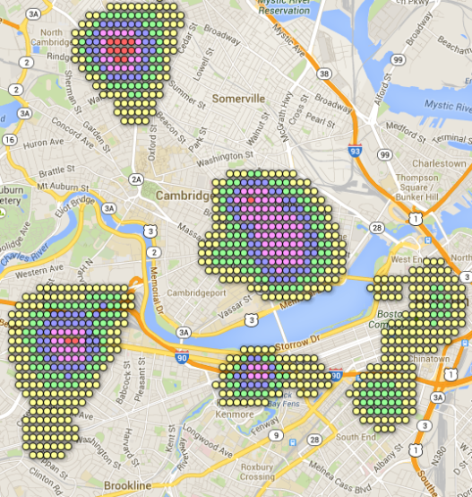

I love beer. I love data. This is a dangerous combination. In two
weeks, some of my high school friends will be in Boston, and I'm
trying to figure out where to take them out for beer. There aren't
many good places near their hotel, so if we're going to travel, I want
to suggest the area with the highest density of good beer bars. While
I've got my suspicions about which part of the city that would be in,
the geek in me decided what I really needed was a computational
solution to this difficult question. Here's the result of several
evenings of work towards answering that question:
 
<figure>
    
    <figcaption>My original Boston Beer Map [Interactive version](https://www.google.com/fusiontables/embedviz?q=select+col0+from+1h5rKKLolfcBL_4W45wPDo1nxFRzySTk7HiY50Vv8+where+col1+%3E%3D+52&amp;viz=MAP&amp;h=false&amp;lat=42.36895682733851&amp;lng=-71.11746981218431&amp;t=1&amp;z=13&amp;l=col0&amp;y=2&amp;tmplt=2&amp;hml=ONE_COL_LAT_LNG)
    </figcaption>
</figure>

This map shows a dense beervana to the north in Davis Square (a 15
minute walk from my apartment!) another hot spot to the southwest in
Alston (home of me and my girlfriend's favorite beer bar, Sunset), and
a large area right smack in the middle of Cambridge, home of the
fantastic Meadhall and Cambridge Brewing Company, as well as the
top-rated "Lord Hobo". 

Okay, so this is a map. How'd I make it?

Well. Remember that part where I said I loved beer and I loved data?
That's why I rate every beer I try and nearly every beer bar I visit,
and post those ratings at [Ratebeer.com](http://www.ratebeer.com/user/101143/), where my
ratings are aggregated with those of thousands of other enormous
nerds. For example, 
[here is](http://www.ratebeer.com/places/regions/boston/1120/21/) a
list of all the top rated beer spots in Boston, including their name,
score and address. And Google has an API that lets you get GPS
coordinates for any address... so I wrote a python program that, given
the URL for a city's top-places list, provides the name,
GPS coordinates, and score of all the places on the list. The program
then finds the most central location, and prunes out all spots farther
than one [Boilermaker](http://www.boilermaker.com/events/15k/) (15 km)
from that central point.

Okay, so now I've got a list of top locations that are really in the
city and not in a suburb 20 miles away. The program then creates a
rectangle around those locations, and breaks it into squares 1/10 of a
mile wide. These squares correspond with the dots seen in the photo
above. Each square is assigned a score based on nearby beer
places. The amount each bar, restaurant, brewery, etc. contributes to
the score of a given square is equal to the percentile rank of that
location over 100, cubed (to emphasize higher rated bars), minus one
point for each hundredth of a mile from the bar to the center of the
square. If this would be negative for a particular bar because the bar
is too far away to make a difference, we round up to zero, essentially
ignoring it. The score for a square is thus the sum of the influences
of all bars upon that square; a square with a very high score means
that there are many good options near that square to get beer.

The maps are created using Google Fusion Tables. Google Fusion Tables
can only display 1000 data points without freaking out and ignoring
random bits of data, so the data points shown in each graph are the
top 1000 nonzero data points.

So now I've got this cool map. Is that enough to sate my thirst for
data?

Hell no.

I spent last weekend on a beercation in D.C. with my girlfriend, so my
next question was how D.C.'s beer scene compared to Boston's,
according to this metric. So I made a [similar map](https://www.google.com/fusiontables/embedviz?q=select+col0+from+1VDID_W4lzCYnu_w1QnznnzpJBO25QSbr0sbmC0cj+where+col1+%3E%3D+55&amp;viz=MAP&amp;h=false&amp;lat=38.91129893531125&amp;lng=-77.01868185845188&amp;t=1&amp;z=13&amp;l=col0&amp;y=2&amp;tmplt=2&amp;hml=ONE_COL_LAT_LNG)
for D.C.

It turns out that D.C. has much higher density of epic beer than does
Boston, so I next made new charts that are on a uniform scale. In
fact, I made them for twenty cities that are purported to be amazing
for beer. While Boston's scale was originally from 0 to 204, the scale
needed to grow quite a bit to accommodate the various cities I
examined... expanding the top of the scale to over triple the maximum
value for Boston: **688**. Here are links to the maps for
the cities I looked at, in alphabetical order. 

- [Ashville, North Carolina](https://www.google.com/fusiontables/embedviz?q=select+col0+from+1ietsc1eZShKHTRJTqs2VzJl3lobs3gCNXEnhGo44+where+col1+%3E%3D+29&amp;viz=MAP&amp;h=false&amp;lat=35.582524618884754&amp;lng=-82.56045087857461&amp;t=1&amp;z=13&amp;l=col0&amp;y=3&amp;tmplt=3&amp;hml=ONE_COL_LAT_LNG)
- [Atlanta, Georgia](https://www.google.com/fusiontables/embedviz?q=select+col0+from+1WVmgyLqFLR3PBoZJitzP8xFJLaaYN5kHUj-L2bSa+where+col1+%3E%3D+58&amp;viz=MAP&amp;h=false&amp;lat=33.75589338023893&amp;lng=-84.35556443954893&amp;t=1&amp;z=13&amp;l=col0&amp;y=3&amp;tmplt=3&amp;hml=ONE_COL_LAT_LNG)
- [Austin, Texas](https://www.google.com/fusiontables/embedviz?q=select+col0+from+1OM8-3XadgiNADiGVSTpa81-Q5g5x1v4cGEqY_4Dk+where+col1+%3E%3D+34&amp;viz=MAP&amp;h=false&amp;lat=30.281364232609405&amp;lng=-97.78105084597814&amp;t=1&amp;z=12&amp;l=col0&amp;y=2&amp;tmplt=2&amp;hml=ONE_COL_LAT_LNG)
- [Baltimore, Maryland](https://www.google.com/fusiontables/embedviz?q=select+col0+from+11p66mZ6Ig7J9M7_AggdgGVVAjqEAEEFuY5zFxRcO+where+col1+%3E%3D+33&amp;viz=MAP&amp;h=false&amp;lat=39.299628507099094&amp;lng=-76.59048724652814&amp;t=1&amp;z=12&amp;l=col0&amp;y=2&amp;tmplt=2&amp;hml=ONE_COL_LAT_LNG)
- [Boston, Massachusetts](https://www.google.com/fusiontables/embedviz?q=select+col0+from+1h5rKKLolfcBL_4W45wPDo1nxFRzySTk7HiY50Vv8+where+col1+%3E%3D+52&amp;viz=MAP&amp;h=false&amp;lat=42.367165371041494&amp;lng=-71.13671734407518&amp;t=1&amp;z=13&amp;l=col0&amp;y=3&amp;tmplt=3&amp;hml=ONE_COL_LAT_LNG)
- [Burlington, Vermont](https://www.google.com/fusiontables/embedviz?q=select+col0+from+1ZmOW1sA1k6NsY9dltyxvacWlXXqEiITAMqyOGhBw+where+col1+%3E%3D+1&amp;viz=MAP&amp;h=false&amp;lat=44.410930416816576&amp;lng=-73.15947187634674&amp;t=1&amp;z=12&amp;l=col0&amp;y=3&amp;tmplt=3&amp;hml=ONE_COL_LAT_LNG)
- [Chicago, Illinois](https://www.google.com/fusiontables/embedviz?q=select+col0+from+1g8MeiVwdqc1hYSiogrJ3L3MXPYxYsCmj5y5GJP8v+where+col1+%3E%3D+105&amp;viz=MAP&amp;h=false&amp;lat=41.91877998228945&amp;lng=-87.67696821278787&amp;t=1&amp;z=13&amp;l=col0&amp;y=2&amp;tmplt=2&amp;hml=ONE_COL_LAT_LNG)
- [Denver, Colorado](https://www.google.com/fusiontables/embedviz?q=select+col0+from+165cBmYEGv75s73g_qcIqvKa33URDVRX4Q6_MdU2j+where+col1+%3E%3D+62&amp;viz=MAP&amp;h=false&amp;lat=39.748554354695635&amp;lng=-104.98899211512742&amp;t=1&amp;z=13&amp;l=col0&amp;y=3&amp;tmplt=3&amp;hml=ONE_COL_LAT_LNG)
- [Fort Collins, Colorado](https://www.google.com/fusiontables/embedviz?q=select+col0+from+1pBThwtotxyBXG1muLPFheFCryQi6Ifs-amIHgqrA+where+col1+%3E%3D+28&amp;viz=MAP&amp;h=false&amp;lat=40.56651193425478&amp;lng=-105.06442470113359&amp;t=1&amp;z=13&amp;l=col0&amp;y=4&amp;tmplt=4&amp;hml=ONE_COL_LAT_LNG)
- [Los Angeles, California](https://www.google.com/fusiontables/embedviz?q=select+col0+from+19gswpHkxpAOQthyvX4twO3ADIGjPorEkkihYJRw1+where+col1+%3E%3D+42&amp;viz=MAP&amp;h=false&amp;lat=34.09201280510806&amp;lng=-118.27246501224415&amp;t=1&amp;z=12&amp;l=col0&amp;y=2&amp;tmplt=2&amp;hml=ONE_COL_LAT_LNG)
- [New York, New York](https://www.google.com/fusiontables/embedviz?q=select+col0+from+1eGlGUd5if7eTbn78Fu9sLlpFLcG-XC-XsAI-Ldgx+where+col1+%3E%3D+146&amp;viz=MAP&amp;h=false&amp;lat=40.711571924246684&amp;lng=-73.95419192691213&amp;t=1&amp;z=12&amp;l=col0&amp;y=3&amp;tmplt=3&amp;hml=ONE_COL_LAT_LNG)
- [Philadelphia, Pennsylvania](https://www.google.com/fusiontables/embedviz?q=select+col0+from+1U99876PUkXfTMkOaVW8qdi8T1mLlch19_WsU2DYJ+where+col1+%3E%3D+89&amp;viz=MAP&amp;h=false&amp;lat=39.950963809857235&amp;lng=-75.1482882430315&amp;t=1&amp;z=13&amp;l=col0&amp;y=2&amp;tmplt=2&amp;hml=ONE_COL_LAT_LNG)
- [Portland, Maine](https://www.google.com/fusiontables/embedviz?q=select+col0+from+1sHhtVmtJFXTS8u8Hc0GjTnkgTp1Qy1MaGRdNeoG6+where+col1+%3E%3D+1&amp;viz=MAP&amp;h=false&amp;lat=43.66861976458928&amp;lng=-70.28506927992281&amp;t=1&amp;z=13&amp;l=col0&amp;y=2&amp;tmplt=2&amp;hml=ONE_COL_LAT_LNG)
- [Portland, Oregon](https://www.google.com/fusiontables/embedviz?q=select+col0+from+1wTsgDgxDbaHEw8eYdWkui88-kwzy8L99mZ272RIW+where+col1+%3E%3D+92&amp;viz=MAP&amp;h=false&amp;lat=45.532491182819065&amp;lng=-122.64669387437664&amp;t=1&amp;z=13&amp;l=col0&amp;y=3&amp;tmplt=3&amp;hml=ONE_COL_LAT_LNG)
- [Providence, Rhode Island](https://www.google.com/fusiontables/embedviz?q=select+col0+from+1zj-4hKdXts7WbfGhw1Z3QoWAiQsa5L2ESiwZEcRa+where+col1+%3E%3D+17&amp;viz=MAP&amp;h=false&amp;lat=41.774970377792776&amp;lng=-71.40554913207501&amp;t=1&amp;z=12&amp;l=col0&amp;y=2&amp;tmplt=2&amp;hml=ONE_COL_LAT_LNG)
- [San Diego, California](https://www.google.com/fusiontables/embedviz?q=select+col0+from+1C6E7Zn_86cyKNGFutuphjCrQ0wKxEckbpg7lVN_C+where+col1+%3E%3D+71&amp;viz=MAP&amp;h=false&amp;lat=32.7667853759319&amp;lng=-117.14709162894529&amp;t=1&amp;z=12&amp;l=col0&amp;y=2&amp;tmplt=2&amp;hml=ONE_COL_LAT_LNG)
- [San Francisco, California](https://www.google.com/fusiontables/embedviz?q=select+col0+from+1Ift6CsdZm6GEDnKBHsfRQGPC8OzHW5XKI-4YyWh7+where+col1+%3E%3D+57&amp;viz=MAP&amp;h=false&amp;lat=37.76607347218969&amp;lng=-122.3951745509951&amp;t=1&amp;z=13&amp;l=col0&amp;y=3&amp;tmplt=3&amp;hml=ONE_COL_LAT_LNG)
- [Santa Fe, New Mexico](https://www.google.com/fusiontables/embedviz?q=select+col0+from+1orHxGO0t5WbJyh0D4ch5vPMuDenzJprIo3WF3mQ9+where+col1+%3E%3D+1&amp;viz=MAP&amp;h=false&amp;lat=35.611005019258364&amp;lng=-106.03424617920315&amp;t=1&amp;z=12&amp;l=col0&amp;y=2&amp;tmplt=2&amp;hml=ONE_COL_LAT_LNG)
- [Seattle, Washington](https://www.google.com/fusiontables/embedviz?q=select+col0+from+1ts_ElA9innykK4OJWUP8yqHag_5nxwlkkZ-b8YY1+where+col1+%3E%3D+77&amp;viz=MAP&amp;h=false&amp;lat=47.62611815229102&amp;lng=-122.33865672378147&amp;t=1&amp;z=12&amp;l=col0&amp;y=2&amp;tmplt=2&amp;hml=ONE_COL_LAT_LNG)
- [Washington, DC](https://www.google.com/fusiontables/embedviz?q=select+col0+from+1VDID_W4lzCYnu_w1QnznnzpJBO25QSbr0sbmC0cj+where+col1+%3E%3D+55&amp;viz=MAP&amp;h=false&amp;lat=38.906373258931914&amp;lng=-77.0357407077866&amp;t=1&amp;z=13&amp;l=col0&amp;y=3&amp;tmplt=3&amp;hml=ONE_COL_LAT_LNG)

How did they rank? If you look at the maps, you'll notice that in some cities, such as New York or DC, there are multiple neighborhoods that peak above 375. Here's the list of such neighborhoods, ranked by peak magnitude.

- Philadelphia, PA: Thomas Jefferson University - 688
- Asheville, NC: Patton at Broadway - 610.8
- NY, NY: Manhattan: Lower Manhattan: Bowery - 610.6
- Fort Collins, CO - 488
- Denver, CO: LODO - 488
- NY, NY: Brooklyn: Greenpoint - 439
- Washington, DC: Dupont Circle - 428
- Washington, DC: Logan Circle- 419
- NY, NY: Flatiron District - 401
- Portland, ME: Downtown - 393
- Atlanta, GA: Decatur - 380
- Portland, OR: West Side - 379
- Washington, DC: Adams Morgan - 378

Things to notice: while the list includes some big cities like New
York (thrice!), bigger doesn't mean better. Coming in #4 is the city
of Fort Collins, which only has 151,000 people. How? Well this little
city is the home to 15 breweries, and there's only one main drag
through town (which, coincidentally, served in part as inspiration for
Disney Parks' "Main Street USA "). Similarly, Los Angeles was nowhere
close to appearing on the list. It turns out the sprawling nature of
LA means that the beer is pretty spread out as well... the only city
near it that has a good concentration of beer is Pasadena. While the
tiny but beer-fueled city of Burlington didn't make the list, it
performed much better than some of the other contenders, such as
Providence and Santa Fe.  

Then there's Philadelphia.
<figure>
  
</figure>

Wow! Philadelphia has some great beer for sure, but I didn't realize
it had such a dense core. The score accrued by the spread of beer bars
in the few blocks between city hall and Thomas Jefferson University is
the score you'd get from having seven world class bars stacked on top
of each other. 

It's obvious what all these stacked bars call for... a stacked bar
chart. (How's that for a segue?)

Here we can see the distribution of the 1000 highest-valued points in each city between our five score intervals: 0-125 (yellow), 126-250 (green) 251-375 (blue) 376-500 (pink) and 501+ (red).

<figure></figure>

This suggests another potentially useful metric: While cities like
Chicago, San Francisco, Seattle and Portland may not have the hotspots
of Asheville or Fort Collins, they certainly have larger portions of
the city in the green, meaning there are larger portions of the city
that you can visit or live in and still have <em>options</em> of where
to go for your brews. 

Of course there's much more to look into here. The current analysis
doesn't differentiate between bars, brewpubs, restaurants with good
beer, stores that sell beer, and breweries. Maybe the maps would be
different if beer stores and breweries were removed. Second, distance
is currently calculated through differences in latitude and longitude,
as the crow flies. A more useful metric would be time taken to travel
via public transportation. This would be much trickier to calculate,
though, and probably isn't how I should be spending my time. Finally,
the current metric is based on Ratebeer place ratings. What if my
model were more interesting, i.e., by number of taps and bottles? The
map could then reflect the number of beer taps within a five minute
walk! 

Obviously there are lots of interesting ways my model can be
altered. Did you find it interesting? Were the graphs cool? Can you
think of ways you'd make use of them on beercations or, say, when
choosing an apartment? I'd love to hear your thoughts!
