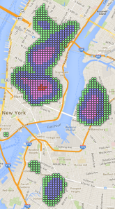
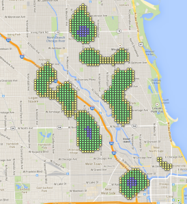
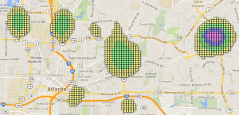
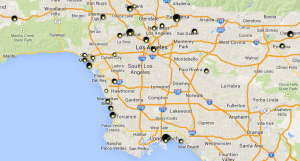
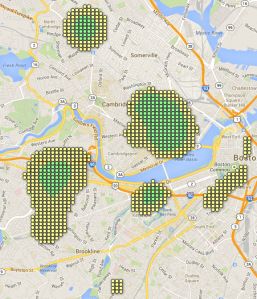
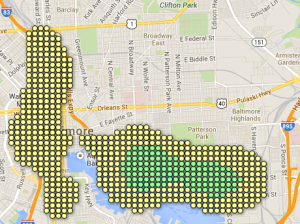
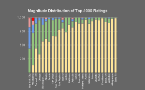

#Recap#

Last week, I presented visualizations of beer-dense neighborhoods in
twenty American cities. I encourage those who didn't see my original
post to 
[check it out](http://theaigeek.wordpress.com/2014/03/28/high-density-beerlytics-data-visualization-of-beer-neighborhoods)
for an explanation of my methodology (which I've since realized may be
similar to multivariate kernel density estimation?).

In my original approach, I considered all the locations RateBeer could
tell me about, including beer stores and homebrew shops that were
particularly good. This week, I'm paring back the set of locations I
look at: if we only look at bars, brewpubs and restaurants, are our
results the same? The question we're looking into this week is subtly
different from that of last week. My original graphs may have been
better tailored to determining where to live to be surrounded by good
beer, whereas the graphs I'll present here may be more applicable to
those just looking to go out and grab a pint or two or three. In
addition to paring back the types of locations looked at, I also
expanded my search area in each city, to make sure I wasn't missing
any high-density areas of sprawling cities like L.A.

# Results #

First, let's compare how the rankings we presented last week have
changed:
## Previous Criteria ##
Considering all beer-related locations, we produced the following list
of locations in our previous post:

1. Philadelphia, PA: Thomas Jefferson University: 688
2. Asheville, NC: Patton at Broadway: 610.8
3. NY,NY: Bowery: 610.6
4. Fort Collins, CO: 597
5. Denver, CO: LODO: 488
6. Brooklyn, NY: Williamsburg: 439
7. Washington, DC: Dupont Circle: 428
8. Washington, DC: Logan Circle: 419
9. NY,NY: Flatiron District: 401
10. Portland, ME: Downtown: 393
11. Atlanta, GA: Decatur: 380
12. Portland, OR: West Side: 379
13. Washington, DC: Adams Morgan: 378

## New Criteria ##

Only considering bars, brewpubs and restaurants, we get the following
list of top neighborhoods:

1. Philadelphia, PA: Thomas Jefferson University: 667
2. Fort Collins, CO: 449
3. NY,NY: Bowery: 409
4. Denver, Colorado: LODO: 407
5. Asheville, NC: Patton at Broadway 406
6. NY,NY: Flatiron District: 393
7. Atlanta, GA: Decatur: 388
8. Brooklyn, NY: Williamsburg: 374
9. Philadelphia, PA: Finn's Landing: 353
10. Portland, OR: West Side: 332
11. Washington, DC: Dupont Circle: 332
12. Portland, ME: Downtown: 327
13. San Diego, CA: Northblock Lofts: 301

## Discussion ##

Most neighborhoods have dropped quite a bit. Two of DC's three salient
neighborhoods have dropped of our radar, and Atlanta has climbed a few
spots. There were two main surprises for me, though. First,
Philadelphia has barely dropped at all. It's so far out ahead of
everyone else, it's shocking. Second, I expected Fort Collins to drop
as well, since I'm no longer counting the many breweries that beef up
Fort Collins' downtown. But, as a colleague reminded me, many of Fort
Collins' breweries double as killer brewpubs. And thus, Fort Collins
is #2 in this analysis.

So yes, this changed between-city rankings. But within particular
cities, did this effect interesting changes? I live in Boston. Let's
look at Boston! Here's Boston's new map, using within-city color
scaling. Click on the map for the interactive version (same with all 
the images in this post)

<figure>
  
</figure>

If you compare this to last week, you'll see that Davis Square (the
neighborhood to the north) is no longer the beery center of Boston,
which is instead now found in Cambridge. This matches the expectations
we previously had: Cambridge has much better beer bars, Medford has
much better beer shops. 

I also thought it'd be interesting to look at how cities compared as a
whole: if you sum up the scores of the top 1000 locations for each
city, you can assign it a city-wide score.

1. NY, NY: 224,109
    <figure>
      
      <figcaption>The City That Never Sleeps (because there are too many options)</figcaption>
    </figure>
2. Philadelphia, PA: 182,093
    <figure>
      
      <figcaption>The City of Beerily Love</figcaption>
    </figure>
3. Portland, OR: 124,470
    <figure>
      
      <figcaption>Beervana. No really, [that's what it's called](http://en.wikipedia.org/wiki/Nicknames_of_Portland,_Oregon#Beervana)</figcaption>
    </figure>
4. Chicago, IL: 119,740
    <figure>
      
      <figcaption>Second (bar this block) City</figcaption>
    </figure>
5. Washington, DC: 111,581
    <figure>
      
      <figcaption>Chocolate (stout) City</figcaption>
    </figure>
6. Atlanta, GA: 104,684
    <figure>
      
      <figcaption>Hoplanta</figcaption>
    </figure>
7. Seattle, WA: 103,337
    <figure>
      
      <figcaption>The City of Goodbeer</figcaption>
    </figure>
8. San Diego, CA: 101,266
    <figure>
      
      <figcaption>San Diego's nickname is "America's Finest City." I'm not even going to dignify that with a parody.</figcaption>
    </figure>
9. San Francisco, CA: 90,388
    <figure>
      
      <figcaption>The City That Knows How (to beer it up, apparently)</figcaption>
    </figure>
10. Los Angeles, CA: 86,866
    <figure>
      
      <figcaption>Look at LA's map. Can you see why it doesn't have peaks like Philly or DC? Everything's so spread out. Worst. Crawl. City. Ever.</figcaption>
    </figure>
11. Denver, CO: 85,938
    <figure>
      
      <figcaption>I'd like to go to Denver.</figcaption>
    </figure>
12. Boston, MA: 82,527
    <figure>
      
      <figcaption>I live in Boston, it's awesome. So much science!</figcaption>
    </figure>
13. Baltimore, MD: 63,851
    <figure>
      
      <figcaption>Everything I know about the parts of Baltimore that are not the waterfront area, I learned from The Wire.</figcaption>
    </figure>

This gives a metric for the amount of beer-friendly space in a city,
although obviously this is going to have a mild correlation with the
size of the city, as seen below.

<figure>
  
  <figcaption></figcaption>
</figure>

That being said, Portland,OR has the lowest population of the top 13,
but has the third highest city score, and overall this may still be a
useful way to think about what cities are most likely to provide you a
reliable source of craft beer goodness. I think it helps get at what
we see in the stacked bar chart: yes, Philadelphia has that downtown
beer Mecca. But over half of New York City's top-1000 spots are blue
or better; it still has a lot of good beer but its spread out a little
more (although not so much as in, e.g., Los Angeles).

<figure>
  
  <figcaption></figcaption>
</figure>

Finally, here is a list of maps for those cities we examined that have
not yet been linked to in this article (some of which are locations
requested by readers).

1. -- [Albuquerque, NM](https://www.google.com/fusiontables/embedviz?q=select+col0+from+1NVtywUZMRsFDMRCt5wfjbB01ocGfHG4cshe-BbGv&amp;viz=MAP&amp;h=false&amp;lat=35.143102806963235&amp;lng=-106.60498796248828&amp;t=1&amp;z=12&amp;l=col0&amp;y=2&amp;tmplt=2&amp;hml=ONE_COL_LAT_LNG)
2. -- [Asheville, NC](https://www.google.com/fusiontables/embedviz?q=select+col0+from+1NHP-QkApngEeV-nATJscCertXLRqvl74F8tWAM&amp;viz=MAP&amp;h=false&amp;lat=35.588339972988386&amp;lng=-82.56529277043491&amp;t=1&amp;z=13&amp;l=col0&amp;y=2&amp;tmplt=2&amp;hml=ONE_COL_LAT_LNG)
3. [Austin, TX](https://www.google.com/fusiontables/embedviz?q=select+col0+from+1zI24EVoxBbaeAQ2htmRjx_WnyLIpWF4FxqPQE5uh&amp;viz=MAP&amp;h=false&amp;lat=30.27318381831279&amp;lng=-97.75116011167461&amp;t=1&amp;z=12&amp;l=col0&amp;y=2&amp;tmplt=2&amp;hml=ONE_COL_LAT_LNG)
4. [Bend, OR](https://www.google.com/fusiontables/embedviz?q=select+col0+from+1EMsLMuVPL9nGnsDF3yOeC2M_F9SI8q-hRoAG2enF&amp;viz=MAP&amp;h=false&amp;lat=44.043973234895&amp;lng=-121.30529981975195&amp;t=1&amp;z=13&amp;l=col0&amp;y=2&amp;tmplt=2&amp;hml=ONE_COL_LAT_LNG)
5. [Boise, ID](https://www.google.com/fusiontables/embedviz?q=select+col0+from+1Bc1qogdrMTQKVvfw079M_7-dpRq9jFi7hHJMRqx3&amp;viz=MAP&amp;h=false&amp;lat=43.609329549101524&amp;lng=-116.2405102988496&amp;t=1&amp;z=13&amp;l=col0&amp;y=2&amp;tmplt=2&amp;hml=ONE_COL_LAT_LNG)
6. [Buffalo, NY](https://www.google.com/fusiontables/embedviz?q=select+col0+from+1iYdSlPRNQhZVPFYkMpeflBWvHTbBZcnWKt_ELt6q&amp;viz=MAP&amp;h=false&amp;lat=42.882016765827174&amp;lng=-78.83617535815823&amp;t=1&amp;z=13&amp;l=col0&amp;y=2&amp;tmplt=2&amp;hml=ONE_COL_LAT_LNG)
7. [Burlington, VT](https://www.google.com/fusiontables/embedviz?q=select+col0+from+13HicpdcPFd_YtBaJ4H8wBq5BwRjoFDyw5P0qxdsc&amp;viz=MAP&amp;h=false&amp;lat=44.418363329555994&amp;lng=-73.16405502600293&amp;t=1&amp;z=13&amp;l=col0&amp;y=2&amp;tmplt=2&amp;hml=ONE_COL_LAT_LNG)
8. [Charlotte, NC](https://www.google.com/fusiontables/embedviz?q=select+col0+from+1W17WLY5r4CR694mMrBQoaPv651RXy762y582aDVz&amp;viz=MAP&amp;h=false&amp;lat=35.21967263885339&amp;lng=-80.76663986074277&amp;t=1&amp;z=12&amp;l=col0&amp;y=2&amp;tmplt=2&amp;hml=ONE_COL_LAT_LNG)
9. [Dallas, TX](https://www.google.com/fusiontables/embedviz?q=select+col0+from+1-DkPZVpJ06dS89y1aiKDTeoFUFeNhZa8rxKobFZO&amp;viz=MAP&amp;h=false&amp;lat=32.80601520834502&amp;lng=-96.78015560149493&amp;t=1&amp;z=13&amp;l=col0&amp;y=2&amp;tmplt=2&amp;hml=ONE_COL_LAT_LNG)
10. [Fort Collins, CO](https://www.google.com/fusiontables/embedviz?q=select+col0+from+1SDVEl2fMsIjgk43v2uoGJzxy4qg9bZVbxogwvYwP&amp;viz=MAP&amp;h=false&amp;lat=40.49310861801775&amp;lng=-105.05446990995557&amp;t=1&amp;z=13&amp;l=col0&amp;y=2&amp;tmplt=2&amp;hml=ONE_COL_LAT_LNG)
11. [Kalamazoo, MI](https://www.google.com/fusiontables/embedviz?q=select+col0+from+1djjhkndetX859LE-K6s-ZJNpgt16Cvi1smAfBPug&amp;viz=MAP&amp;h=false&amp;lat=42.26486093611286&amp;lng=-85.5506941158003&amp;t=1&amp;z=13&amp;l=col0&amp;y=2&amp;tmplt=2&amp;hml=ONE_COL_LAT_LNG)
12. [Louisville, KY](https://www.google.com/fusiontables/embedviz?q=select+col0+from+1jyt5t0RfxHBoilqnia_tNFPO1zFSNse1lnDx8NWM&amp;viz=MAP&amp;h=false&amp;lat=38.18120630468355&amp;lng=-85.69953644920353&amp;t=1&amp;z=13&amp;l=col0&amp;y=2&amp;tmplt=2&amp;hml=ONE_COL_LAT_LNG)
13. [Portland, ME](https://www.google.com/fusiontables/embedviz?q=select+col0+from+1s4lGBlbejm67_LefWBPAIlEnl7y-FPrZ1Sp4xChr&amp;viz=MAP&amp;h=false&amp;lat=43.63645880564882&amp;lng=-70.24129067265733&amp;t=1&amp;z=13&amp;l=col0&amp;y=2&amp;tmplt=2&amp;hml=ONE_COL_LAT_LNG)
14. [Providence, RI](https://www.google.com/fusiontables/embedviz?q=select+col0+from+1YgkCKpyCr9ar31t30YIH5qAwywCQRqg8I4RMGoF8&amp;viz=MAP&amp;h=false&amp;lat=41.62904905700631&amp;lng=-71.37898181873122&amp;t=1&amp;z=11&amp;l=col0&amp;y=2&amp;tmplt=2&amp;hml=ONE_COL_LAT_LNG)
15. [Santa Fe, NM](https://www.google.com/fusiontables/embedviz?q=select+col0+from+1Ga8fP0AQm-sgRfdUMvcqz2mF7xV9x8ZSQCwf5WwR&amp;viz=MAP&amp;h=false&amp;lat=35.601629219633764&amp;lng=-105.95387828300784&amp;t=1&amp;z=13&amp;l=col0&amp;y=2&amp;tmplt=2&amp;hml=ONE_COL_LAT_LNG)

